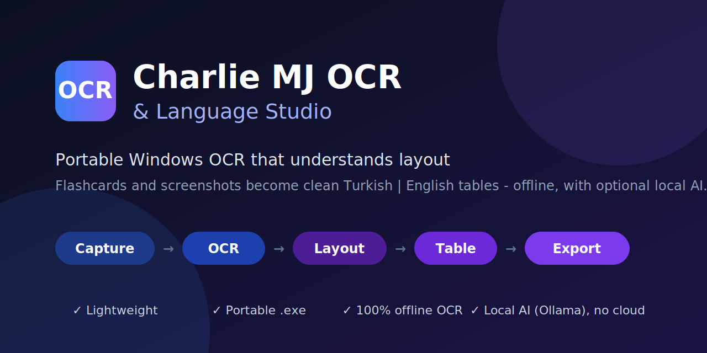
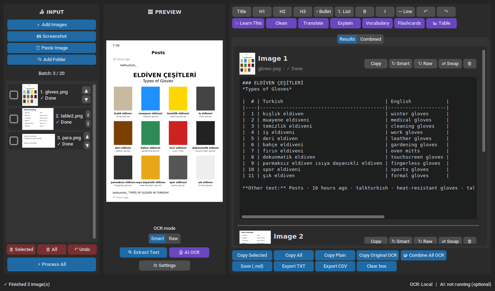

<!--
  README.md - main entry point of the repository.
  Short overview + quick start. Detailed documents live in the docs/ folder.
-->

<p align="center">
  
</p>

<h1 align="center">Charlie MJ OCR &amp; Language Studio</h1>

<p align="center">
  <b>A lightweight, portable Windows OCR tool that turns flashcards and screenshots into clean, organised study tables — with optional local AI.</b>
</p>

<p align="center">
  
  
  
  
  
  
</p>

<p align="center">
  <a href="./CharlieMJ-OCR-Portable/CharlieMJ-OCR-Portable.zip">
    
  </a>
</p>

---

## What is it?

Typing every word from a flashcard by hand is slow, and normal OCR gives you a messy block of text. **Charlie MJ OCR & Language Studio** reads the *layout* of the picture, so a Turkish label and the English text under it end up side by side:


> **Image → OCR with word positions → structure detection → clean table → (optional local AI) → Copy / Export**



## Key features

- 🧠 **Smart OCR** – detects the structure (card grids, two-column lists, titles, paragraphs) and builds an aligned **Original | Translation** table. **Raw OCR** is still available for plain text.
- 🔢 **One result per image** – every image gets its own card titled **Image 1, Image 2, …** with a thumbnail, a **break line** between images, and per-image *Copy, Smart, Raw, Swap, Delete*. Numbers update automatically when you delete or reorder (▲ ▼).
- 🧩 **Combine All OCR** – merge all results into one text with `## Image N` headings and `---` separators.
- 📸 **Input** – add many images, a folder, paste from clipboard, or drag a screenshot area. Batch limit (default 20) with Remove / Remove All / Undo.
- 📝 **Notes editor** – Title, H1–H3, bullets, numbering, bold, italic, line, undo/redo; copy selected / all / plain / original OCR.
- 💾 **Export** – Markdown, TXT, and Anki-ready CSV (`Image, Original, Translation`, duplicates removed).
- 🤖 **Local AI (optional, no cloud)** – through [Ollama](https://ollama.com): Learn This, Clean, Table, Translate, Explain, Vocabulary, Flashcards, AI OCR. No account, no API key, text never leaves your PC.
- 🔒 **Safe by design** – offline OCR, localhost-only AI, no installer, no admin rights, no startup entries, pinned dependencies, checksummed builds. See [Security](docs/SECURITY.md).
- 🪶 **Lightweight & portable** – about 100–150 MB, runs from a USB drive.

Full list: [docs/FEATURES.md](docs/FEATURES.md)

## Quick start

### Option A — Get the `.exe` from GitHub (no installs)
1. Upload this repository to your GitHub account (keep the hidden `.github` folder).
2. Open the **Actions** tab → **Build Windows portable EXE** → **Run workflow**.
3. After ~10 minutes download the **CharlieMJ-OCR-Portable** artifact, unzip it and run **`CharlieMJ-OCR.exe`**.

### Option B — Build it yourself
Install Python 3.11, put Tesseract + language data in a `tesseract/` folder, then double-click **`build.bat`**.

### Option C — Run from source
```bash
pip install -r requirements.txt
python main.py
```

### Optional: local AI
Install Ollama from [ollama.com](https://ollama.com), run `ollama pull gemma3:4b`, then press **Settings → Test AI connection**. OCR works without it.

Step-by-step details and troubleshooting: [docs/INSTALLATION.md](docs/INSTALLATION.md)

## How to use

1. **⚙ Settings** → choose your learning language and your language.
2. Add images (**＋ / 📸 / 📋 / 📂**).
3. Choose **Smart** or **Raw**, then **⚡ Process All** (or **🔍 Extract Text** for one image).
4. Check each **Image N** card; use **⇄ Swap** if the columns are reversed.
5. **Copy** or **Export**.

More: [docs/USER_GUIDE.md](docs/USER_GUIDE.md)

## Technology

Python 3.11 · CustomTkinter · Pillow · Tesseract (pytesseract) · Ollama (local AI, optional) · PyInstaller · GitHub Actions. Why these were chosen (and why PaddleOCR was not bundled): [docs/TECHNOLOGIES.md](docs/TECHNOLOGIES.md)

## Documentation

| Document | What you will find |
|----------|--------------------|
| [Project Overview](docs/PROJECT_OVERVIEW.md) | What the program is, why it was built, goals |
| [Features](docs/FEATURES.md) | Complete feature list |
| [Smart OCR](docs/SMART_OCR.md) | How messy images become clean tables |
| [Local AI](docs/LOCAL_AI.md) | Ollama setup, models, AI buttons, troubleshooting |
| [Technologies](docs/TECHNOLOGIES.md) | Tech stack and the reasons behind it |
| [Architecture](docs/ARCHITECTURE.md) | Layers, data flow, threading, diagrams |
| [Security](docs/SECURITY.md) | Privacy, antivirus false positives, verifying downloads |
| [Installation](docs/INSTALLATION.md) | Build the `.exe`, requirements, troubleshooting |
| [User Guide](docs/USER_GUIDE.md) | Workflows, buttons, tips |
| [Testing](docs/TESTING.md) | Unit tests and the end-to-end UI smoke test |
| [Roadmap](docs/ROADMAP.md) | Planned versions and ideas |

## Repository structure

```text
charliemj-ocr-studio/
├── README.md                    ← you are here
├── main.py                      ← entry point
├── app/                         ← the application package
│   ├── config.py                   settings, paths, constants
│   ├── layout.py                   structure detection (pure Python, unit-tested)
│   ├── ocr_engine.py               Tesseract: words + positions
│   ├── local_ai.py                 optional local AI (Ollama, localhost only)
│   └── ui.py                       the window
├── tests/                       ← unit tests + end-to-end UI smoke test
├── docs/                        ← detailed documentation (table above)
├── assets/                      ← banner, diagrams, screenshots
├── requirements.txt             ← pinned runtime dependencies
├── requirements-build.txt       ← + PyInstaller (build only)
├── build.bat                    ← local build of the portable .exe
├── version_info.txt             ← publisher info embedded in the .exe
├── .github/workflows/build.yml  ← cloud build + tests + Defender scan + checksums
├── .gitignore  ·  LICENSE
```

## Privacy & security

- OCR runs **entirely on your PC**.
- The optional AI talks only to **Ollama on localhost**; other addresses are refused by the code.
- No API keys, no accounts, no telemetry, no auto-start, no admin rights.
- Antivirus programs sometimes flag *any* unsigned PyInstaller `.exe`. How the build minimises that, and how to verify your download: [docs/SECURITY.md](docs/SECURITY.md).

## Known limitations

- Smart OCR relies on geometry: very crowded or decorative layouts may need **⇄ Swap** or a manual edit.
- Tesseract can struggle with stylised fonts and some Arabic-script text; local AI OCR is optional and only as good as your model.
- The `.exe` is not code-signed, so Windows SmartScreen may warn on first launch.

## License

Released under the [MIT License](LICENSE).
