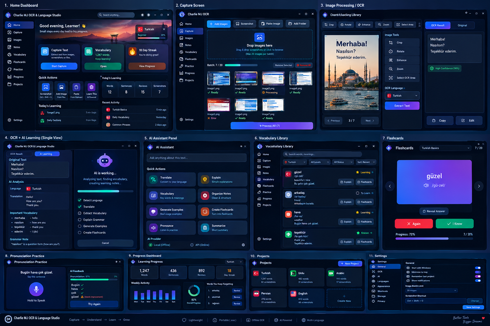

<!--
  README.md - main entry point of the repository.
  Short overview + quick start. Detailed documents live in the docs/ folder.
-->

<p align="center">
  
</p>

<h1 align="center">Charlie MJ OCR &amp; Language Studio</h1>

<p align="center">
  <b>A lightweight, portable Windows OCR + AI tool that turns flashcards and screenshots into clean study notes.</b>
</p>

<p align="center">
  
  
  
  
  
</p>

---

## What is it?

If you learn languages from flashcard images, you know the pain of typing every word by hand. **Charlie MJ OCR & Language Studio** removes that step:

> **Image / Screenshot → OCR → Organised notes → (optional AI) → Copy / Export**

It is a single portable folder with an `.exe` — no installer, works offline for OCR, and AI is only used when you click a button.



## Key features

- 📸 **Input:** add many images, add a folder, paste from clipboard, or drag a screenshot area
- 🖼 **Queue:** thumbnails, status per image, batch limit (default 20), remove / remove all / undo
- 🔍 **Local OCR:** Tesseract — Turkish, Urdu, Arabic, Persian, English — works offline
- 📝 **Notes editor:** Title, H1–H3, bullets, numbered lists, bold, italic, separator, undo/redo
- 📋 **Copy buttons:** Selected, All, Plain text, Original OCR
- 💾 **Export:** Markdown, TXT, and Anki-ready CSV (duplicates removed)
- 🤖 **Optional AI (Gemini):** Learn This, Clean, Translate, Explain, Vocabulary, Flashcards, AI OCR
- 🪶 **Lightweight & portable:** about 100–150 MB, runs from a USB drive

Full list: [docs/FEATURES.md](docs/FEATURES.md)

## Quick start

### Option A — Get the `.exe` from GitHub (no installs)
1. Open the **Actions** tab → **Build Windows portable EXE** → **Run workflow**.
2. After ~10 minutes, download the **CharlieMJ-OCR-Portable** artifact.
3. Unzip and run **`CharlieMJ-OCR.exe`**.

### Option B — Build it yourself
1. Install Python 3.11 and Tesseract; place Tesseract + language data in a `tesseract/` folder.
2. Double-click **`build.bat`**.
3. Your app appears in `dist/CharlieMJ-OCR/`.

### Option C — Run from source
```bash
pip install -r requirements.txt
python main.py
```

Step-by-step instructions and troubleshooting: [docs/INSTALLATION.md](docs/INSTALLATION.md)

## How to use

1. **⚙ Settings** → choose your learning language and (optionally) paste a Gemini API key.
2. **📸 Screenshot** / **＋ Add Images** / **📋 Paste** to fill the queue.
3. **⚡ Process All** (or **🔍 Extract Text** for one image).
4. Format with the toolbar; press **✨ Learn This** for AI notes.
5. **Copy** or **Export**.

More: [docs/USER_GUIDE.md](docs/USER_GUIDE.md)

## Technology

Python 3.11 · CustomTkinter · Pillow · Tesseract (pytesseract) · Google Gemini REST API · PyInstaller · GitHub Actions. Why these were chosen: [docs/TECHNOLOGIES.md](docs/TECHNOLOGIES.md)

## Documentation

| Document | What you will find |
|----------|--------------------|
| [Project Overview](docs/PROJECT_OVERVIEW.md) | What the program is, why it was built, goals and principles |
| [Features](docs/FEATURES.md) | Complete feature list with mockup |
| [Technologies](docs/TECHNOLOGIES.md) | Tech stack, reasons, size, licences |
| [Architecture](docs/ARCHITECTURE.md) | Layers, data flow, threading, diagrams, extension points |
| [Installation](docs/INSTALLATION.md) | Build the `.exe`, requirements, troubleshooting |
| [User Guide](docs/USER_GUIDE.md) | Workflows, buttons, tips, privacy |
| [AI Guide](docs/AI_GUIDE.md) | Gemini setup, AI buttons, adding your own action |
| [Roadmap](docs/ROADMAP.md) | Planned versions and ideas |

## Repository structure

```text
charliemj-ocr-studio/
├── README.md                  ← you are here
├── main.py                    ← the whole application (fully commented)
├── requirements.txt           ← Python dependencies
├── build.bat                  ← local build script for the portable .exe
├── LICENSE                    ← MIT licence
├── .gitignore                 ← ignored files (config.json, build output, …)
├── .github/workflows/build.yml← cloud build of the Windows .exe
├── assets/                    ← banner, architecture diagram, UI mockup
└── docs/                      ← detailed documentation (see table above)
```

## Privacy & security

- OCR runs **entirely on your PC**.
- Text or images are sent to Google **only** when you press an AI button.
- Your API key is saved in `config.json` next to the app and is excluded from Git by `.gitignore`. Never commit or share it.

## Known limitations

- Tesseract can struggle with decorative fonts and some Arabic-script text — try **AI OCR** for those.
- The `.exe` is not code-signed, so Windows SmartScreen may warn on first launch.
- AI output can contain mistakes; double-check important vocabulary.

## Roadmap

Drag-and-drop, global hotkey, vocabulary library, spaced-repetition review, pronunciation practice and more — see [docs/ROADMAP.md](docs/ROADMAP.md).

## License

Released under the [MIT License](LICENSE).
