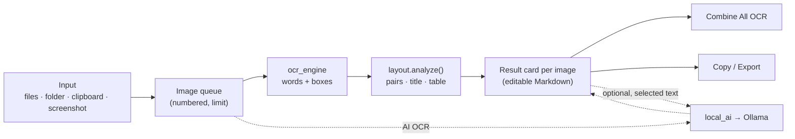
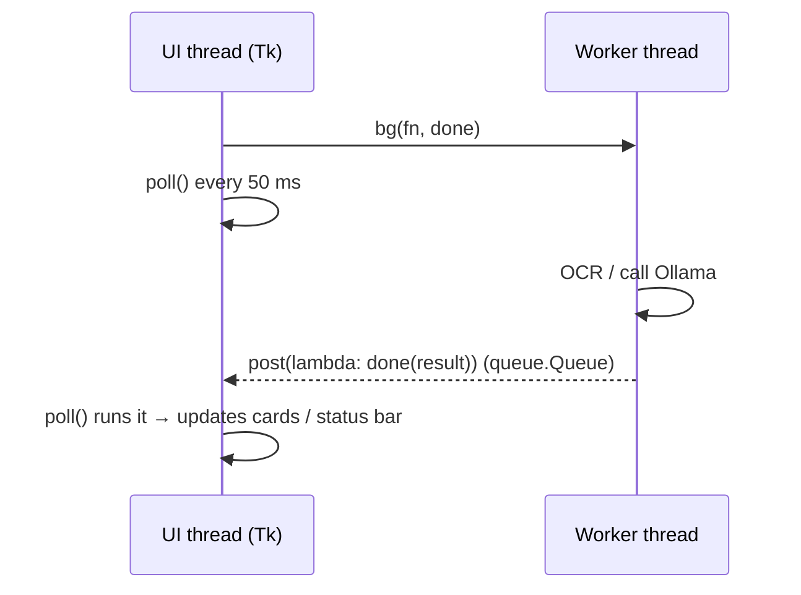
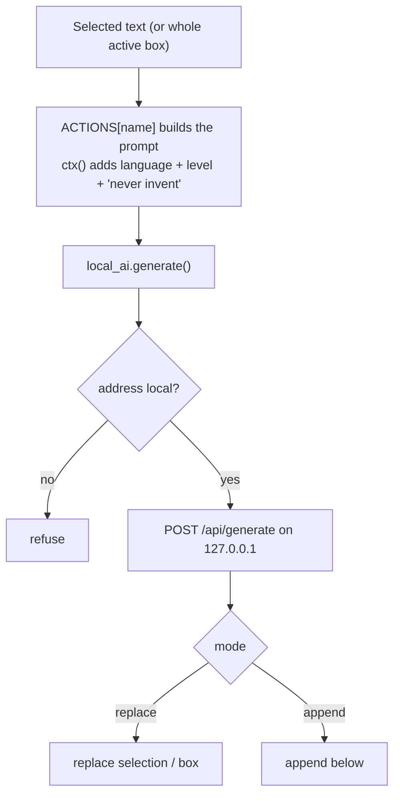
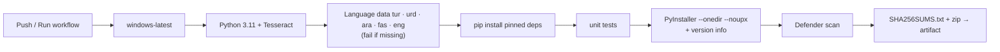

# Architecture

[← Main README](../README.md) · Previous: [Technologies](TECHNOLOGIES.md) · Next: [Installation](INSTALLATION.md)


## 1. Module map

```text
main.py                 entry point (DPI awareness, starts the window)
app/
 ├── config.py          settings file (config.json), paths, constants
 ├── layout.py          PURE logic: segments → pairs → table → Markdown   (unit-tested)
 ├── ocr_engine.py      Tesseract: words with boxes, cell re-read, raw text
 ├── local_ai.py        Ollama over localhost (urllib), status/diagnostics
 └── ui.py              CustomTkinter window, queue, result cards, export
tests/                  unit tests (layout) + headless UI smoke test
```

Dependency direction: `ui → (layout, ocr_engine, local_ai, config)`, `ocr_engine → (layout.Word, config)`. `layout.py` imports nothing from the app, so it can be tested without OCR or a display.

## 2. Data flow



Solid paths need no AI and no internet. Dashed paths are optional and local.

## 3. The item model (single source of truth)

```text
item = { img, name, status, th (thumbnail), sel (checkbox),
         md   : the Markdown shown/edited in the card,
         raw  : untouched OCR text,
         res  : layout.Result (kept so ⇄ Swap can re-render),
         swap : bool,
         tb   : the card's text box while visible }
```

- The queue list `App.items` defines order → **"Image N" = position N**. Reordering or deleting renumbers instantly because titles are computed from the index when cards are rebuilt.
- Cards are only a **view**: `save_cards()` copies their text back into `md` before any rebuild or export. When a fresh result arrives, `it["tb"]` is cleared first so a stale text box can never overwrite it (a bug the smoke test caught).

## 4. Threading model

Tkinter is single-threaded. Worker threads **never touch widgets**; they hand callables to the UI thread through a queue:



`Process All` uses one worker that handles images one by one and posts progress messages; one failing image is marked **Error** and the batch continues.

## 5. Smart OCR

See [Smart OCR](SMART_OCR.md) for the full algorithm. In short: `read_words` → `build_segments` → `drop_noise` → `vertical_pairs` / `horizontal_pairs` → `_orient` → title extraction → cell `refine` → `_reading_order` → `to_markdown`.

The `refine` callback is injected into `analyze()` by the UI, keeping `layout.py` free of OCR dependencies.

## 6. Screenshot capture

`snip()` hides the window → `ImageGrab.grab()` → a full-screen `Toplevel` shows the frozen picture → mouse drag draws the rectangle → coordinates are scaled to real pixels (`k = shot.width / screen_width`) → crop is added to the queue. DPI awareness is enabled in `main.py`.

## 7. Local AI



`local_ai.status()` powers both the status-bar indicator and the Settings connection test.

## 8. Configuration and storage

| Item | Location | Notes |
|------|----------|-------|
| Settings | `config.json` beside the `.exe` | No secrets any more; git-ignored anyway |
| Tesseract | `tesseract/` beside the `.exe` | `TESSDATA_PREFIX` is set at start-up |
| Images, results | Memory only | Nothing is saved until you Save/Export |

`BASE` is `dirname(sys.executable)` when frozen, otherwise the project folder, so the same code runs from source and as an `.exe`.

## 9. Build and release pipeline



## 10. Error handling

| Situation | Behaviour |
|-----------|-----------|
| Batch limit reached | Warning; image not added |
| Unreadable image file | Skipped with a status message |
| OCR fails on one image | Card marked **Error**; batch continues |
| Ollama not running / model missing | Clear message in the status bar; everything else keeps working |
| Non-local AI address | Refused (privacy guard) |
| Missing `config.json` | Defaults are used |
| A UI callback raises | Caught in `poll()`; shown in the status bar; the loop continues |

## 11. Extension points

- **New AI action:** add an entry to `ACTIONS` in `ui.py`; a button appears.
- **New OCR language:** add `.traineddata` and an entry in `config.LANGS`.
- **New layout rule:** add a function in `layout.py` and a unit test.
- **Other OCR engine:** implement `read_words`/`make_refiner` in `ocr_engine.py` with the same return types.
- **New export:** add a branch in `App.export()`.
