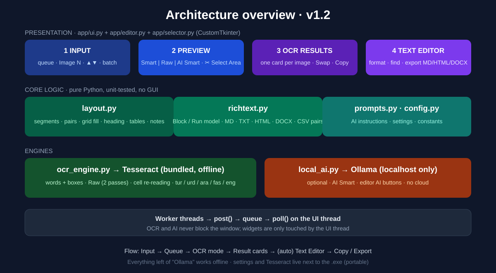
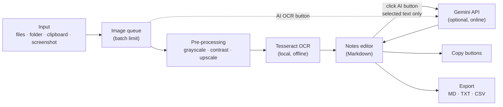
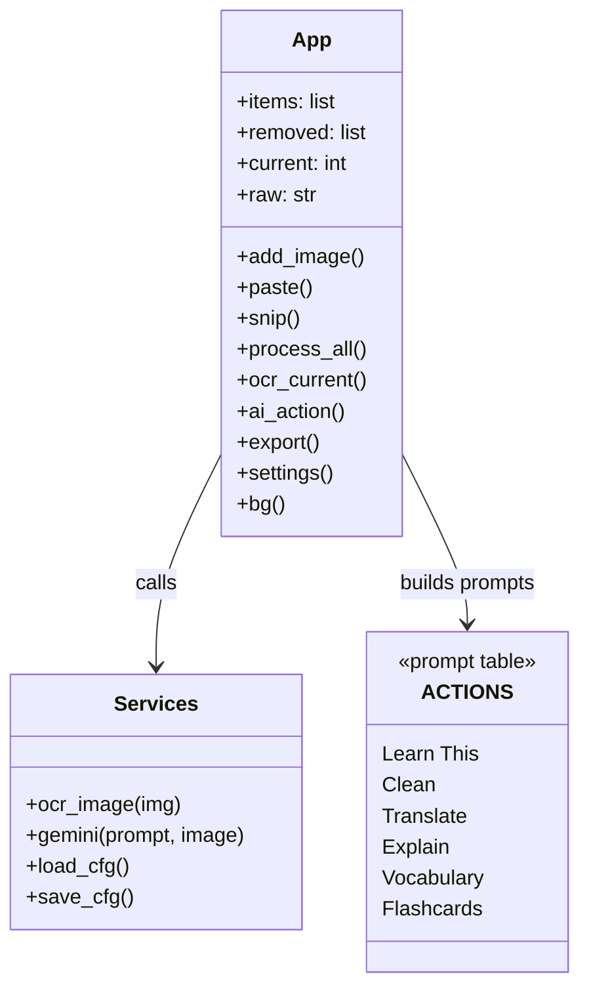
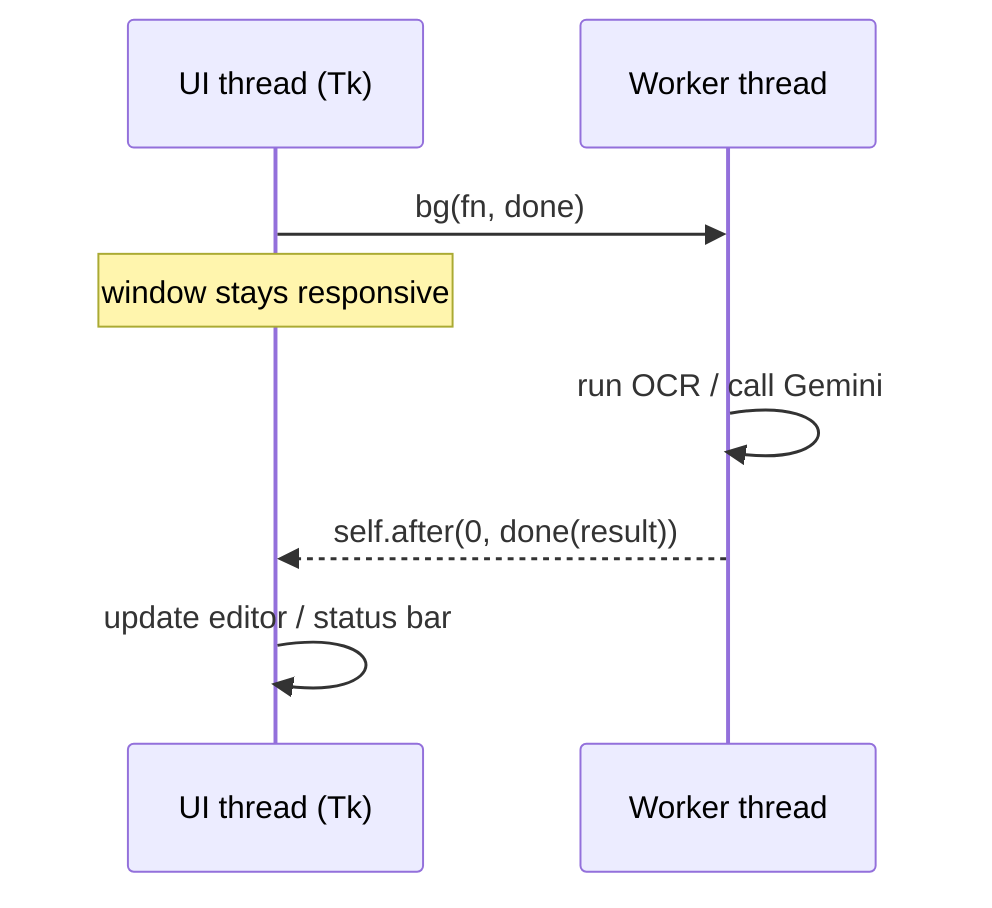
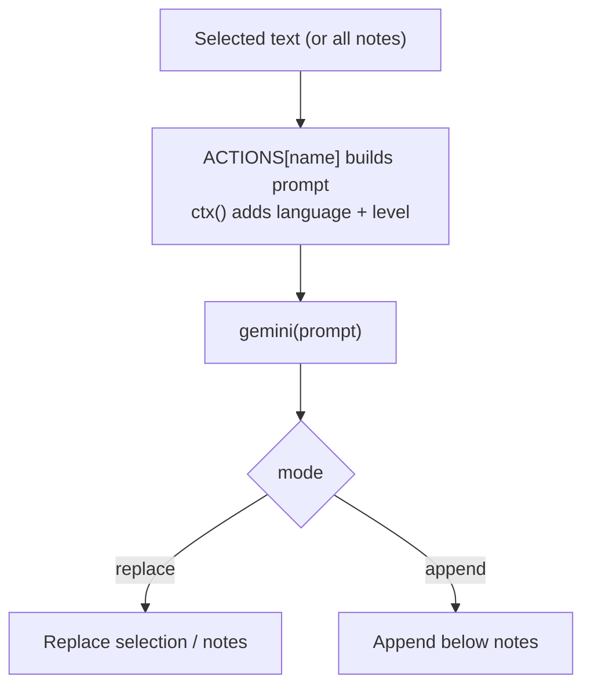
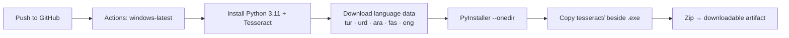

# Architecture

[← Back to main README](../README.md) · Previous: [Technologies](TECHNOLOGIES.md) · Next: [Installation](INSTALLATION.md)



## 1. High-level data flow



The solid path (input → OCR → editor → copy/export) needs **no internet**. The dashed/AI paths are optional.

## 2. Layers

| Layer | Responsibility | Where in code |
|-------|----------------|---------------|
| Presentation | Widgets: queue, preview, editor, toolbars, settings, status bar | `App.build_queue/build_preview/build_notes/settings` |
| Application logic | Queue management, screenshot snipper, Markdown helpers, export, threading | `App` methods |
| Services | `ocr_image()` (Tesseract), `gemini()` (HTTP), `load_cfg()/save_cfg()` | module-level functions in `main.py` |
| External | Tesseract executable + `.traineddata`; Gemini REST endpoint | `tesseract/` folder; `generativelanguage.googleapis.com` |

## 3. Main components



### Queue item (in-memory record)

```text
{ img: PIL.Image, name: str, status: waiting|working|done|error,
  text: str, th: thumbnail, sel: BooleanVar }
```

## 4. Concurrency model

Tkinter is **single-threaded**: only the main thread may touch widgets. Slow work (OCR, network) must not block it, so:



- `App.bg()` starts a daemon thread and posts the result back with `self.after(0, …)`.
- Exceptions are caught and shown in the status bar instead of crashing.
- `Process All` uses one worker thread that processes images sequentially.

## 5. Screenshot capture

1. `snip()` hides the main window and waits 350 ms.
2. `ImageGrab.grab()` captures the screen.
3. A full-screen `Toplevel` shows the frozen capture on a `Canvas`.
4. Mouse down/drag/up draws and finalises the rectangle.
5. The selection is scaled from canvas to real pixels (`k = shot.width / screen_width`), cropped, and added to the queue.

High-DPI support comes from `SetProcessDpiAwareness(1)`, which makes Windows report true pixel sizes.

## 6. Configuration and storage

| Item | Location | Notes |
|------|----------|-------|
| Settings | `config.json` next to the `.exe` | Contains the API key; **git-ignored** |
| Tesseract | `tesseract/` next to the `.exe` | Located through `BASE`; `TESSDATA_PREFIX` is set at start-up |
| Images & notes | Memory only | Nothing persists until you Save/Export |

`BASE` is `dirname(sys.executable)` when frozen by PyInstaller, otherwise the script folder — so the same code runs in development and as an `.exe`.

## 7. AI integration



Vocabulary is requested in one strict shape — `- **word** — meaning` — which the CSV exporter parses. Details: [AI Guide](AI_GUIDE.md).

## 8. Build and release pipeline



## 9. Error handling

| Situation | Behaviour |
|-----------|-----------|
| Batch limit reached | Warning dialog; image not added |
| OCR fails on one image | Card marked **Error**; batch continues |
| No API key / network error | Message in status bar; app keeps working |
| Nothing selected for AI | Uses all notes; if empty, shows "Nothing to send to AI" |
| Missing `config.json` | Defaults are used |

## 10. Extension points

- **New AI action:** add an entry to `ACTIONS`; a button appears automatically.
- **New OCR language:** add the `.traineddata` file and an entry in `LANGS`.
- **New export format:** add a branch in `App.export()`.
- **Alternative OCR engine:** replace the body of `ocr_image()` (e.g. RapidOCR).
