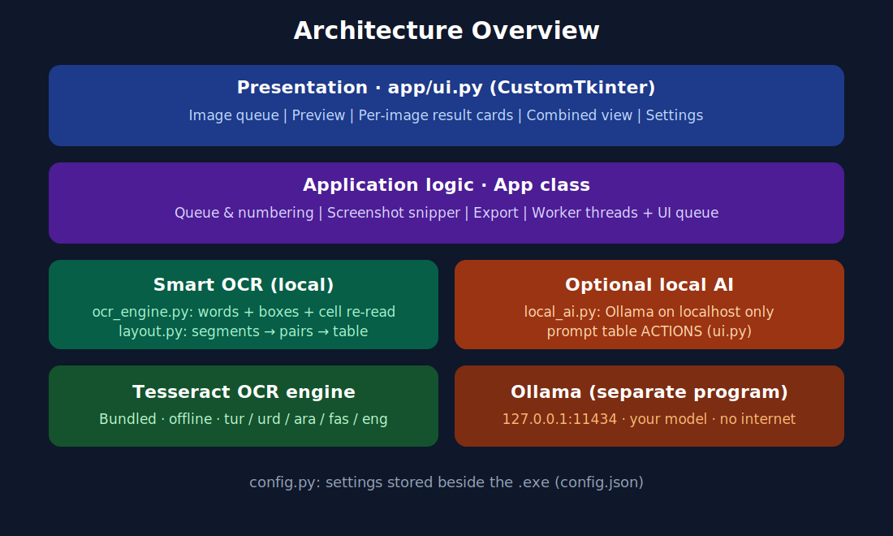
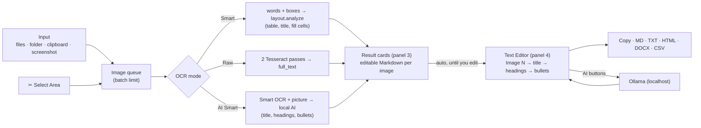
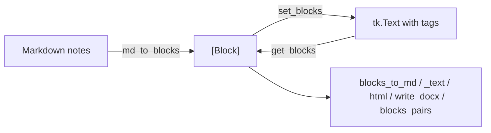

# Architecture

[← Back to main README](../README.md) · Previous: [Technologies](TECHNOLOGIES.md) · Next: [Security](SECURITY.md)



## 1. Data flow

The whole path from input to export works **offline**; local AI is optional.

## 2. Modules (`app/`)
| Module | Responsibility | Depends on |
|--------|----------------|------------|
| `config.py` | settings (`config.json`), paths, constants | — |
| `layout.py` | structure detection, Markdown tables and notes, pair extraction — **pure Python** | — |
| `ocr_engine.py` | Tesseract: words with boxes, Raw text, cell re-reading | `layout.Word`, Pillow, pytesseract |
| `richtext.py` | document model (`Block`, `Run`) + exporters — **pure Python** | — |
| `editor.py` | the formatted editor widget (`RichEditor`) | `richtext`, Tk |
| `selector.py` | the Select Area tool: viewport rendering, zoom / fit / pan, rotate, crop, several boxes | Pillow, Tk |
| `widgets.py` | `FlowFrame`: toolbars that wrap onto more rows on narrow panels | CustomTkinter |
| `prompts.py` | prompts for the local AI | `config` |
| `local_ai.py` | Ollama HTTP client (localhost only, stdlib `urllib`) | — |
| `ui.py` | main window, queue, cards, threads, glue | all of the above |

Pure-Python modules (`layout`, `richtext`) contain the logic that matters most and are fully unit-tested.

## 3. Item model
Every queue entry is a dict: `img, name, status, th, sel, kind (smart|raw|ai), md, raw, res, swap, tb`.
`md` is the editable text of the result card; `res` is the `layout.Result`. **"Image N" is the position in the
queue**, so numbering is automatic. The editor is *derived* from the items (`ui.editor_blocks`), never the other way.

## 4. Editor model

Formatting is stored as *semantic* tags (`b i u s sz_n fg_x bg_x p_h1 …`). Tk cannot combine "bold" and "size"
tags, so `restyle()` adds one rendering tag per run (`r_<bold><italic>_<size>`) from the semantic ones.

## 5. Concurrency
Tkinter is single-threaded. OCR and AI run in worker threads (`ui.bg`); workers never touch widgets — they `post()`
callbacks into a `queue.Queue` that the UI thread drains every 60 ms (`ui.poll`). Exceptions are caught and shown in
the status bar. *Process All* uses one worker thread and processes images in order.

## 6. Editor ↔ OCR synchronisation
`auto_sync()` rebuilds the editor after OCR / delete / move / swap **only if the user has not edited it**
(`editor.dirty`). **⟳ Update** forces a rebuild (after confirmation) and keeps a backup for **⤺ Restore**.

## 7. Configuration and storage
`config.json` and `tesseract/` live next to the `.exe` (`BASE`), so the app is portable. Images and notes exist
only in memory until exported.

## 8. Build and release

```mermaid
flowchart LR
    A["Push / Run workflow"] --> B["windows-latest"]
    B --> C["Python 3.11 + Tesseract (trimmed)"]
    C --> D["Language data tur · urd · ara · fas · eng"]
    D --> E["Unit tests (blocking)"]
    E --> F["OCR integration test (informational)"]
    F --> G["PyInstaller --onedir --noupx"]
    G --> H["Defender scan + SHA256SUMS"]
    H --> I["CharlieMJ-OCR-Portable.zip"]
```


## 9. Error handling
| Situation | Behaviour |
|-----------|-----------|
| Batch limit reached | warning; image not added |
| OCR fails on one image | card marked **Error**; batch continues |
| AI unavailable in AI Smart | falls back to text-only AI, then to the Smart result, with a status message |
| AI error in an editor button | message in the status bar; text unchanged |
| User edited the editor | automatic updates are paused; nothing is overwritten |
| Missing `config.json` | defaults are used |

## 10. Extension points
* **New AI button** → add an entry to `prompts.ACTIONS`.
* **New OCR language** → add its `.traineddata` and an entry in `config.LANGS`.
* **New export format** → add a writer in `richtext.py` and a branch in `RichEditor.write`.
* **Different OCR engine** → replace `ocr_engine.read_words / read_raw` (return `layout.Word` lists).

## v1.3 additions

### Captured areas belong to their image
```text
item (Image N)
 ├── md / res / kind        the image's own result
 └── areas[]                records of the same shape ("parent" = the item, "n" = 1, 2, …)
       ├── Area 1  ──►  OCR in the current mode  ──►  its own text box in the card
       └── Area 2  ──►  …
editor_blocks():  Image N (title) → file name → notes → "Area 1" (h3) + notes → "Area 2" … → separator
```
An area does **not** count against the batch limit; the **New image** target of the tool still creates a normal item.

### Grid completion pipeline (`layout.analyze` → `_lattice`)
```text
words → segments → pairs → orientation → heading
      → lattice (columns by weighted fit, rows by spacing)
      → every cell re-read by ocr_engine.make_cell_reader (wide crop, borders snapped to white gaps,
        words kept by centre) → replaces the first reading
      → missing rows between / above / below (accepted only if ≥ half of the columns read)
      → Deep: single-language voting, second pass at larger scale
      → coverage numbers (grid, unread, doubtful) → status bar
```

### Selector rendering
Only the visible rectangle of the original picture is cropped and resized for every redraw
(`AreaSelector.render`), boxes are kept in original-picture pixels, and OCR reads the original — see [Select Area](SELECT_AREA.md).

### Thread safety
Tk variables are never read inside worker threads (the accuracy level is read from the plain settings dict);
workers only post callables to the UI queue.
