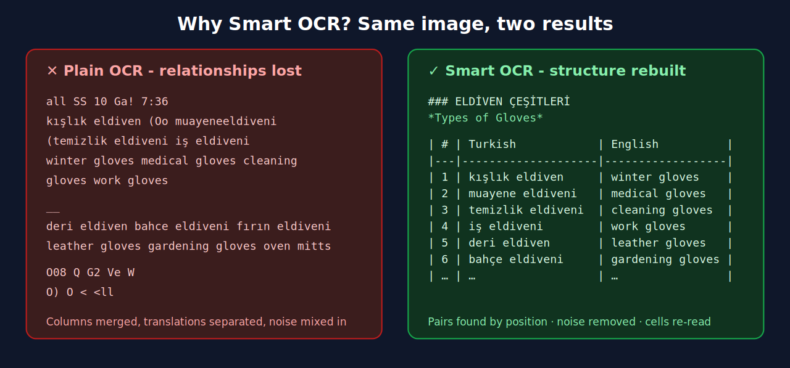

# Project Overview

[← Main README](../README.md) · Next: [Features](FEATURES.md)

## What is this program?

**Charlie MJ OCR & Language Studio** is a lightweight, portable Windows desktop application for language learners. It reads text from pictures (flashcards, social-media vocabulary posts, textbook pages, screenshots) and — unlike an ordinary OCR tool — **understands the layout**. A card that shows a Turkish word with its English translation underneath becomes a row in a clean two-column table, not a jumble of words.

It ships as **one folder with an `.exe`**: no installer, OCR works fully offline, and the optional AI runs **locally on your own PC** (through Ollama) — nothing is sent to the cloud.

## Why was it built?

The author learns several languages (Turkish, Urdu, Arabic, Persian, English) from downloaded flashcards. The old workflow was:

1. Look at a flashcard image and **type every word by hand**, or ask an online AI and paste the answer back.
2. Format the notes manually.
3. Repeat for dozens of images.

The first version of this tool added OCR, but the result was **messy**: plain OCR returns one long string and destroys the relationship between words ("kışlık eldiven" and "winter gloves" end up in different places). Version 1.1 fixed the root cause by keeping **word positions** and rebuilding the structure; version 1.2 adds three OCR modes, an area-selection tool and a text editor for the final notes.

## Goals

| Goal | How it is met |
|------|---------------|
| No manual typing | Screenshot / paste / add images → OCR |
| No messy output | **Smart OCR**: word positions → pairs → aligned table |
| Easy to review | One card per image: **Image 1, Image 2, …** with separators |
| Handle batches | Queue (default 20), Process All, reorder, delete, undo |
| Easy copying | Copy per image, selected, all, plain, original OCR |
| Private & safe | Offline OCR, local AI only (localhost), no telemetry, pinned dependencies |
| Clean, complete vocabulary | **Smart** (table) / **Raw** (every word) / **AI Smart** (title, headings, bullets) modes |
| OCR only the part you need | **✂ Select Area** tool (zoom, fit, crop): each box is added to the image it came from |
| Ready-to-use study notes | **Text Editor** panel: automatic *Image N → title → headings → bullets*, formatting, DOCX / HTML / CSV export |
| Lightweight & portable | Python + Tkinter + Tesseract; no Electron, no bundled AI models |

## Non-goals (for now)

- Not a full spaced-repetition app (see [Roadmap](ROADMAP.md)).
- Not a cloud service: no account, server or database.
- Not a dictionary — AI answers must be double-checked.

## Design principles

1. **Extract, then understand, then organise.** OCR extracts words with positions; a deterministic layout step finds structure; AI is only an optional helper. AI never silently rewrites OCR.
2. **Local first.** OCR and AI both run on your PC.
3. **Every step is optional.** Screenshot → OCR → Copy works in two clicks.
4. **Never lose the original.** Raw mode and "Copy Original OCR" always give the untouched text.
5. **Portable and unsurprising.** Settings live next to the `.exe`; nothing is installed or registered.

## Related documents
[Features](FEATURES.md) · [Smart OCR](SMART_OCR.md) · [Local AI](LOCAL_AI.md) · [Technologies](TECHNOLOGIES.md) · [Architecture](ARCHITECTURE.md) · [Installation](INSTALLATION.md) · [User Guide](USER_GUIDE.md) · [Security](SECURITY.md) · [Testing](TESTING.md) · [Roadmap](ROADMAP.md)

New in v1.2: [OCR Modes](OCR_MODES.md) · [Text Editor](EDITOR.md) · [Changelog](CHANGELOG.md)
