# Smart OCR — How Messy Pictures Become Clean Tables

[← Back to main README](../README.md) · See also: [OCR Modes](OCR_MODES.md) · [Architecture](ARCHITECTURE.md)

Plain OCR returns one long string and **loses the relationship between words** — the Turkish label and the English
text under it end up far apart. Smart OCR keeps every word's **position** and rebuilds that relationship with
deterministic geometry (no AI, nothing invented). It lives in `app/layout.py` and is unit-tested without a GUI.

## Pipeline

```mermaid
flowchart LR
    A["Image"] --> B["Prepare<br/>gray · invert dark · contrast · 2× upscale"]
    B --> C["Tesseract --psm 11<br/>words + boxes + confidence"]
    C --> D["Segments<br/>lines split at wide gaps"]
    D --> E["Noise filter<br/>UI text · watermark · symbols"]
    E --> F["Pairs<br/>vertical or horizontal"]
    F --> G["Consistency<br/>drop captions / footers"]
    G --> H["Orient<br/>which side is the learned language"]
    H --> I["Bands + heading"]
    I --> J["Re-read cells<br/>language specific"]
    J --> K["Fill missing cells"]
    K --> L["Table + Other text"]
```

## Steps in detail
1. **Prepare** — grayscale; invert light-on-dark screenshots; auto-contrast; upscale small images (phone text is tiny).
2. **Words with boxes** — sparse mode (`--psm 11`) finds scattered labels that normal page analysis skips.
3. **Segments** — words on one line are split wherever the gap is wider than ~1.1× the text height. This separates
   the columns of a card grid, which normal OCR glues into one line.
4. **Noise filter** — drops low-confidence fragments, symbol-only text, oversized shaky text (watermarks) and
   phone / social chrome (`Posts`, `20 hours ago`, `more`, counters).
5. **Pairs** — *vertical* (label with its translation directly **below**; similar text size; same column) or
   *horizontal* (a line with exactly two blocks = a two-column table). The method that finds more pairs wins.
6. **Consistency** — a pair that is unusually wide (a caption line) or low-confidence **and** lines up with no other
   pair (left / centre / right edge) is rejected → captions and footers can no longer become table rows.
7. **Orientation** — Arabic script decides for Urdu / Arabic / Persian; for Turkish its special letters; ties follow
   the majority position (upper / left = original). **⇄ Swap** fixes the rest.
8. **Bands + heading** — pairs are grouped into rows. A pair is the **heading** only if it is *alone in the first
   row*, clearly bigger than the labels and confident — a watermark or a big word inside the grid cannot be a title.
   A standalone big line right above the table is also accepted (with its subtitle).
9. **Re-read cells** — each cell is cropped and read again with the single-language model (`tur` for the original,
   `eng` for the translation), which is better for `ş ı ğ ç`. A new reading is **rejected** if it lost letters or
   changed the word (a photo edge once turned `güzellik beni` into `bea`).
10. **Fill missing cells** — the grid is inferred from the cells that were found (column centres, row pitch). Every
    empty position — and any whole row missing between two found rows — is cropped, enlarged and read as a
    two-line block. This recovered `çil / freckle`, which the first pass had skipped.
11. **Output** — an aligned Markdown table, the heading, and an *Other text* line for everything that is left.

## Result on the test poster
`tests/make_poster.py` builds a replica of a typical Instagram vocabulary post (3×5 photo grid, watermark, phone
header, caption). Smart OCR returns **12 of 12 pairs correct**, no title (there is none), no caption rows.
Raw mode finds every word. These checks run in `tests/test_ocr_integration.py`.

## Known limits
* Pairing is geometric: crowded or decorative layouts can need **⇄ Swap**, **✂ Select Area** or a manual edit.
* Tesseract can struggle with stylised fonts and some Arabic-script text; try Raw or AI Smart.
* Real photos are harder than the test replica; accuracy depends on resolution — use full-size screenshots.

## Tuning
Settings → *Ignore OCR text below this confidence* (default 45). Lower it if real text disappears; raise it if junk appears.
