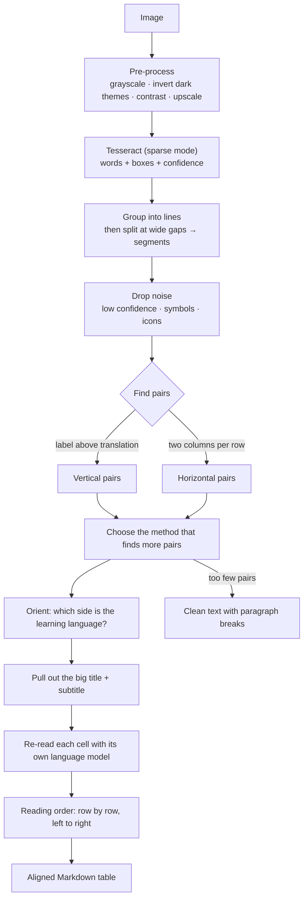

# Smart OCR — how messy images become clean tables

[← Main README](../README.md) · Previous: [Features](FEATURES.md) · Next: [Local AI](LOCAL_AI.md)

## The problem

Plain OCR does **Image → one long string**. For a vocabulary card this loses the most important information — *which word belongs with which translation* — because that relationship is stored in **position**, not in text.

## The idea

> **OCR extracts. Geometry finds structure. A formatter organises. AI only helps — it never rewrites silently.**

Smart OCR keeps every word's bounding box and rebuilds the structure with simple, deterministic rules (no guessing, nothing invented). The code is in `app/layout.py` (pure Python, unit-tested) and `app/ocr_engine.py`.

## Pipeline

## Step by step

| Step | What happens | Why |
|------|--------------|-----|
| Pre-process | Grayscale, invert dark screenshots, auto-contrast, upscale ×2/×3 | Tesseract reads larger dark-on-light text far better |
| Sparse OCR | Tesseract `--psm 11` returns every word with box + confidence | Finds scattered labels instead of assuming one text block |
| Segments | Words → lines → split where the gap is wider than ~1.1× the text height | Separates the 4 columns of a card grid that share one text line |
| Noise filter | Remove fragments with confidence below the setting, mostly digits/symbols, or single-letter debris | Hides clocks, icons, "O) O <" |
| Vertical pairs | Link each segment to the nearest one **directly below** in the same column (closest first, one-to-one) | Card = label + translation underneath |
| Horizontal pairs | A line with exactly two segments = two-column row | Classic vocabulary table |
| Orientation | Arabic-script text is decisive for Urdu/Arabic/Persian; Turkish uses its special letters; English uses common words; ties follow the majority position | Puts the learning language in column 1 |
| Title | A pair with text ≥ 1.35× larger than the others becomes title + subtitle | Not a vocabulary row |
| Cell re-read | Each cell is cropped and read again as one line with **only** its language (`tur` for column 1, `eng` for column 2) | Fixes `kislik → kışlık`, `is → iş` |
| Order | Rows are banded by height, then sorted left→right | Reading order of the original card grid |
| Output | Padded Markdown table; leftover text listed under **Other text** | Aligned in the editor, valid Markdown anywhere |

If fewer than 3 pairs are found (or they cover less than half of the text), the image is treated as normal text and shown as **clean paragraphs**.

## Modes

| Mode | Use when |
|------|----------|
| **Smart** (default) | Flashcards, vocabulary posts, two-column tables, mixed screenshots |
| **Raw** | You only want the text exactly as Tesseract returns it |
| **🤖 AI OCR** | A hard font or script where Tesseract fails (needs a local vision model) |

## Tuning

| Setting | Effect |
|---------|--------|
| *Minimum OCR confidence* (Settings, default 45) | Higher = cleaner but may drop faint words; lower = keeps more |
| Learning / your language | Decides table headers, OCR models and orientation |
| **⇄ Swap** (per image) | Flips the columns if the guess was wrong |
| **↻ Raw** | Quick check of what OCR really found |

## Limitations (honest list)

- **Resolution matters.** Text smaller than roughly 12 px tall (tiny thumbnails) is unreliable. Use the original image, not a shrunken screenshot of a screenshot.
- Layout rules cover cards, two-column tables and paragraphs. Complex magazines, three-column tables or text over photos may fall back to clean text.
- Orientation for **Turkish vs English** relies on Turkish letters and common English words; if every word is ambiguous it uses position — use **⇄ Swap** when needed.
- Right-to-left tables (Urdu/Arabic) are read by position, so verify them once.
- OCR can still misread a letter; check important words (the AI never "fixes" them silently).

See [Architecture](ARCHITECTURE.md) and [Testing](TESTING.md).
